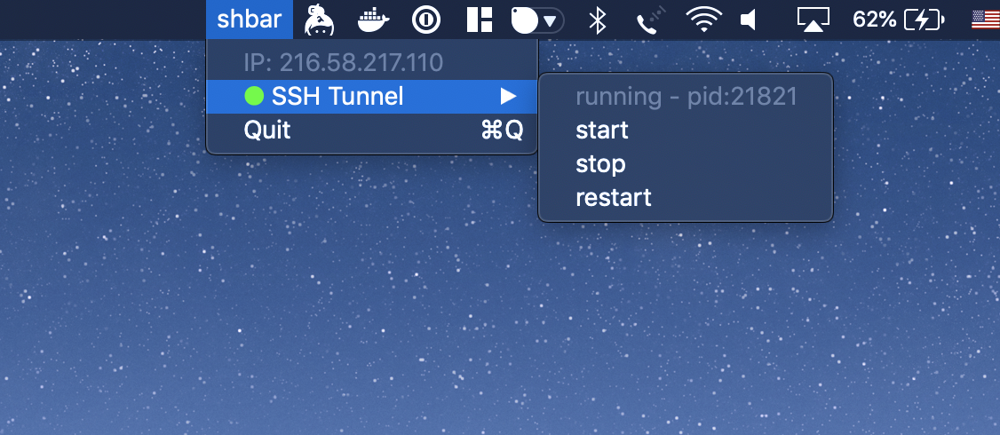

# shbar
Shell Scripting + Jobs in your macOS Menu Bar!

_warning: this is alpha quality software. Use at your own risk._



## Known Issues
- Killing the shbar app does not kill child procesess, on restart new ones are created.

## Install
1. Grab the latest release [here](https://github.com/richinfante/shbar/releases)
2. Download and place unzipped `.app` file into `/Applications`

## Setup
In a file named `~/.config/shbar/shbar.json`, add a file using the following structure:

```json
[
  {
    "titleRefreshInterval" : 120,
    "mode" : "RefreshingItem",
    "title" : "IP Address",
    "actionScript" : {
      "bin" : "\/bin\/sh",
      "args" : [
        "-c",
        "open https:\/\/api.ipify.org"
      ],
      "env" : {
        "PATH" : "\/usr\/bin:\/usr\/local\/bin:\/sbin:\/bin"
      }
    },
    "titleScript" : {
      "bin" : "\/bin\/sh",
      "args" : [
        "-c",
        "echo $(curl https:\/\/api.ipify.org) | tr '\n' ' '"
      ],
      "env" : {
        "PATH" : "\/usr\/bin:\/usr\/local\/bin:\/sbin:\/bin"
      }
    }
  },
  {
    "reloadJob" : false,
    "autostartJob" : false,
    "title" : "~:$",
    "actionShowsConsole" : false,
    "mode" : "RefreshingItem",
    "children" : [
      {
        "autostartJob" : false,
        "mode" : "RefreshingItem",
        "title" : "Setup Help",
        "actionScript" : {
          "bin" : "\/bin\/sh",
          "args" : [
            "-c",
            "open https:\/\/github.com\/richinfante\/shbar"
          ],
          "env" : {
            "PATH" : "\/usr\/bin:\/usr\/local\/bin:\/sbin:\/bin"
          }
        },
        "children" : [

        ],
        "actionShowsConsole" : false,
        "reloadJob" : false
      },
      {
        "shortcutKey" : "q",
        "autostartJob" : false,
        "mode" : "ApplicationQuit",
        "title" : "Quit",
        "actionShowsConsole" : false,
        "reloadJob" : false
      }
    ]
  }
]

```


## Logging
Shbar places logfiles for each process here: `~/Library/Logs/shbar/`. It does not automatically remove the logfiles, but will in a future release.
